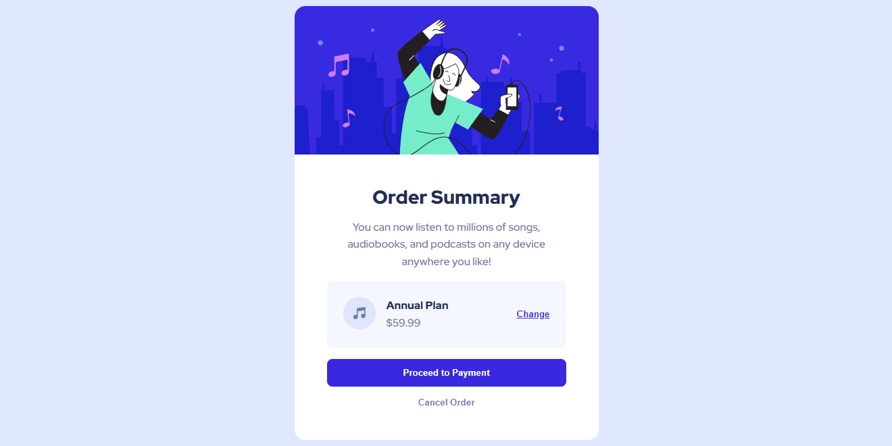

<h1 align="center">order summary</h1>

    <a href="#resultado">resultado</a>
    |
    <a href="#layout">layout</a>

projeto criado para estudos práticos com a metodologia <a href="https://cube.fyi">CUBE CSS</a>

---

<h2 id="resultado">🎯 resultado</h2>
</img>

---

<h2 id="layout">🔖 layout</h2>

Para acessar o layout, será necessário ter uma conta no [GitHub](github.com).
 
Acesse o layout no link abaixo:
* [Layout](https://www.frontendmentor.io/challenges/order-summary-component-QlPmajDUj)

---

✨ coded by Yasmin ✨
